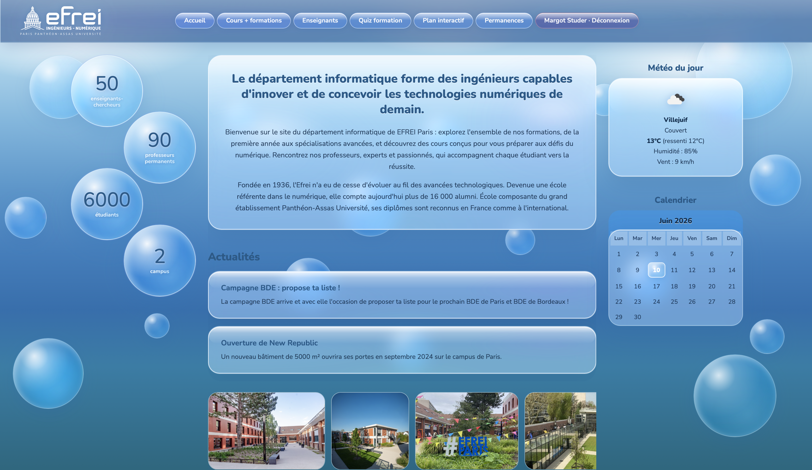
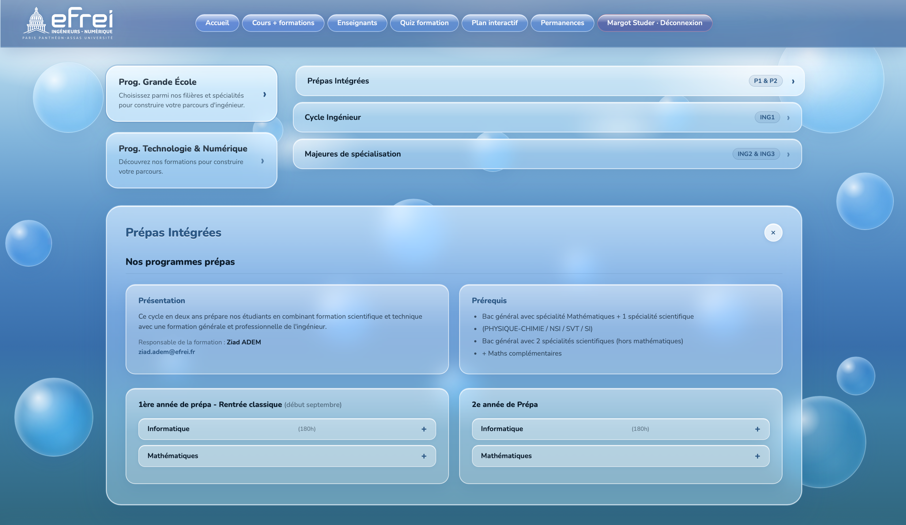
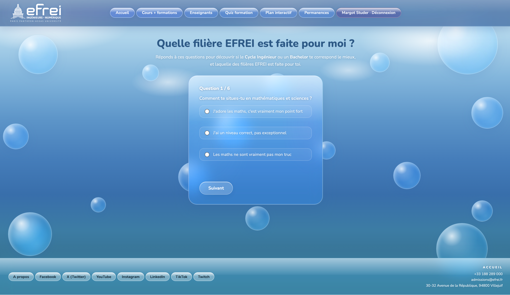
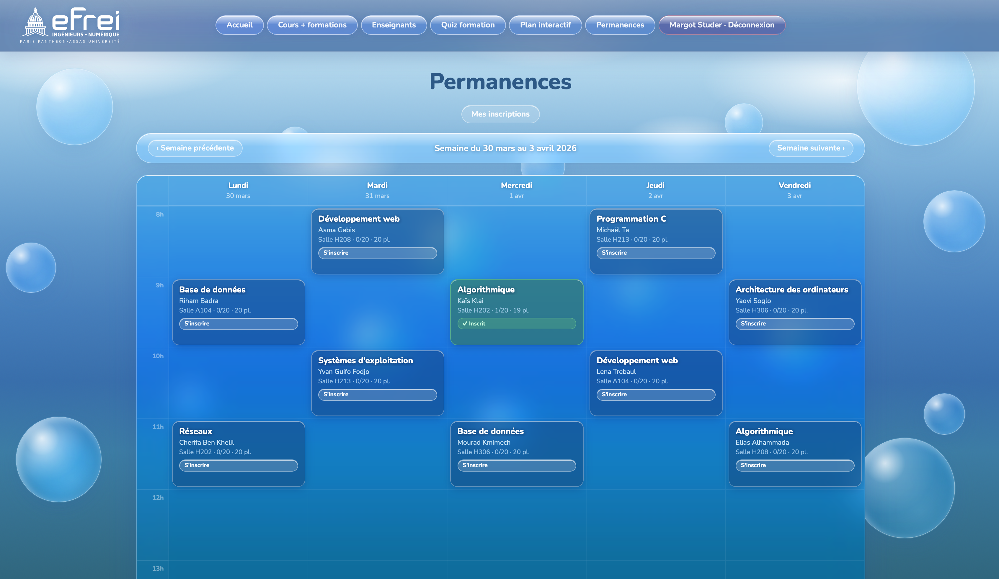
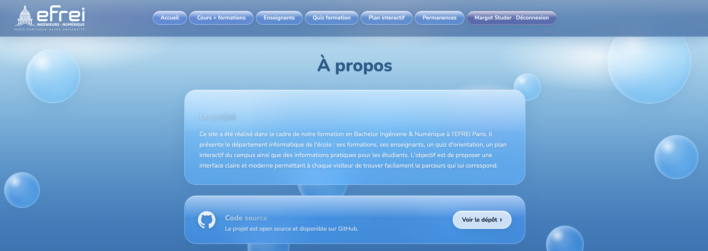
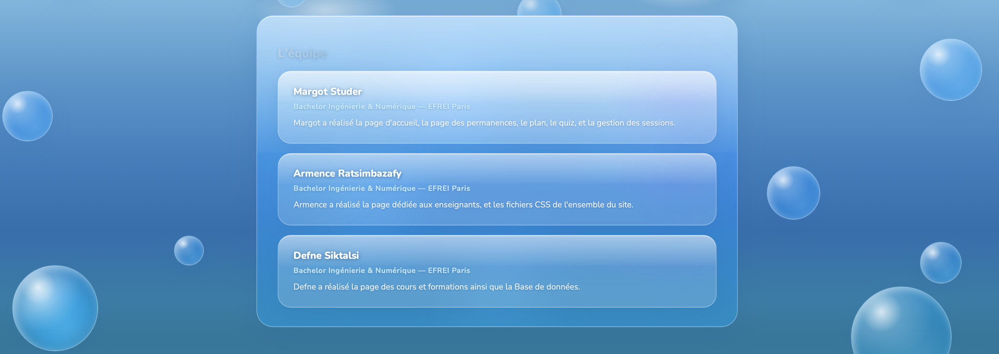
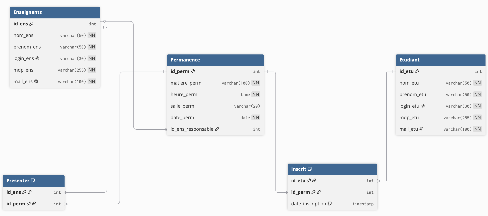

# Site Web Département Informatique — EFREI Paris

**Projet Web · Bachelor Ingénierie & Numérique · EFREI Paris**

Année : 2025 (L1)

**Technologies utilisées :**

- PHP 8 · MySQL 8 · HTML/CSS · JavaScript
- MAMP (serveur local Apache + MySQL)
- phpMyAdmin

**Objectifs :**

- Développement d'un site web complet avec back-end PHP et base de données MySQL
- Gestion des sessions et des rôles (étudiant / enseignant)
- Interface claire et responsive pour les étudiants et les enseignants du département

Ce site présente le département informatique de l'EFREI Paris : ses formations, ses enseignants, un quiz d'orientation, un plan interactif du campus, ainsi qu'un espace de gestion des permanences. Chaque utilisateur se connecte avec son rôle et accède à un espace personnalisé.

---

## 👥 L'Équipe

**Margot Studer** — Bachelor Ingénierie & Numérique, EFREI Paris
Page d'accueil, page des permanences, plan interactif, quiz d'orientation, gestion des sessions.

**Armence Ratsimbazafy** — Bachelor Ingénierie & Numérique, EFREI Paris
Page dédiée aux enseignants, fichiers CSS de l'ensemble du site.

**Defne Siktalsi** — Bachelor Ingénierie & Numérique, EFREI Paris
Page des cours et formations, base de données.

---

## 📸 Aperçu du site

|                         |                         |
| ----------------------- | ----------------------- |
|  |  |
|  |  |
|  |  |

---

## 🗄️ Base de données



La base de données **GestionPermanences** est composée de 5 tables :

| Table         | Rôle                                          |
| ------------- | --------------------------------------------- |
| `Enseignants` | Comptes et informations des enseignants       |
| `Etudiant`    | Comptes et informations des étudiants         |
| `Permanence`  | Créneaux de permanence (matière, date, salle) |
| `Presenter`   | Association enseignant ↔ permanence           |
| `Inscrit`     | Inscriptions étudiant ↔ permanence            |

---

## 🚀 Installation et utilisation

### Prérequis

- [MAMP](https://www.mamp.info/) installé (macOS ou Windows)
- PHP 8.x · MySQL 8.x

### 1. Placer le projet dans MAMP

```
# macOS
/Applications/MAMP/htdocs/Projet_Web/

# Windows
C:\MAMP\htdocs\Projet_Web\
```

### 2. Démarrer MAMP

Lancer MAMP et démarrer les serveurs Apache et MySQL.

| Serveur | Port par défaut |
| ------- | --------------- |
| Apache  | 8888            |
| MySQL   | 8889            |

> **Windows :** les ports MAMP pour Windows sont parfois 80 (Apache) et 3306 (MySQL). Si c'est le cas, mettre à jour le port dans `html/db.php` et accéder au site via `http://localhost/Projet_Web/html/connexion.php`.

### 3. Créer la base de données

Ouvrir phpMyAdmin : `http://localhost:8888/phpMyAdmin`

Exécuter les fichiers SQL **dans cet ordre** :

```
data/DataBase/create-db.sql     ← à faire EN PREMIER (crée les tables)
data/DataBase/Enseignants.sql
data/DataBase/Etudiant.sql
data/DataBase/Permanences.sql
data/DataBase/Presenter.sql
```

### 4. Vérifier la connexion

Le fichier `html/db.php` utilise les paramètres par défaut de MAMP — aucune modification nécessaire :

```
Hôte         : localhost
Port         : 8889
Base         : GestionPermanences
Login        : root
Mot de passe : root
```

### 5. Accéder au site

```
http://localhost:8888/Projet_Web/html/connexion.php
```

---

## 🔑 Comptes de test

### Étudiante — Margot Studer

| Champ        | Valeur          |
| ------------ | --------------- |
| Login        | `margot.studer` |
| Mot de passe | `abc`           |

### Enseignant — Mohamed Hamidi

| Champ        | Valeur           |
| ------------ | ---------------- |
| Login        | `mohamed.hamidi` |
| Mot de passe | `abc`            |

---

## 📁 Structure du projet

```
Projet_Web/
├── html/           Pages PHP (connexion, accueil, permanences, cours…)
├── css/            Feuilles de style
├── js/             Scripts JavaScript
└── data/
    ├── DataBase/   Scripts SQL (schéma + données)
    └── img/        Images (captures d'écran, schéma BDD, photos enseignants…)
```
